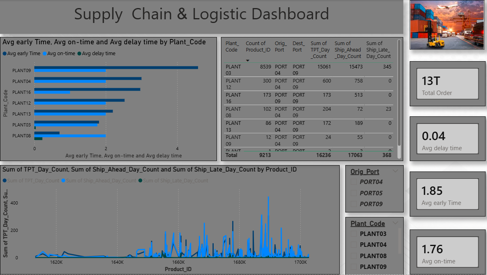

# supply-chain-analysis
Supply Chain Data Analysis using Python and Power BI

📊 Project Overview

This project focuses on analyzing supply chain shipment data to identify delivery delays, shipment performance, and logistics efficiency.
The analysis was performed using Python, and insights were visualized using Power BI.

🛠 Tools & Technologies:
- Python (Pandas, NumPy, Matplotlib, Seaborn)
- Power BI
- Excel

📈 Key Insights
- Analyzed early, on-time, and delayed shipments across different plants
- Identified plant-wise performance variations in delivery efficiency
- Observed shipment trends at product level using time-based metrics
- Highlighted delays and early deliveries to understand logistics performance

📊 Analysis & Visualization
- Performed data cleaning and preprocessing using Python
- Conducted exploratory data analysis (EDA) on shipment and delivery data
- Created visualizations using Matplotlib and Seaborn
- Built an interactive Power BI dashboard to track plant performance, shipment status, and delivery   metrics

📂 Project Files
- supply_chain_analysis.ipynb → Data cleaning, analysis, and visualization using Python
- supply_chain_analysis.pbix → Interactive dashboard created using Power BI

🎯 Business Impact
This project helps companies:
- Reduce delivery delays
- Improve logistics efficiency
- Make data-driven decisions

📸 Dashboard Preview

